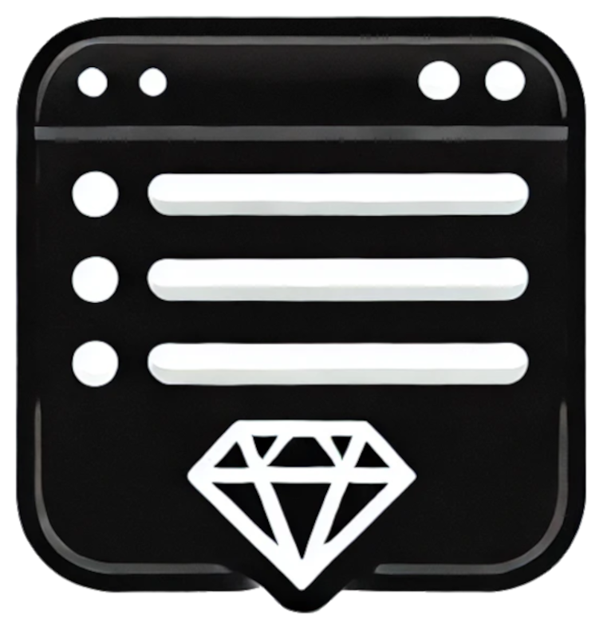

# Simple Navbar

<div style="display: flex; gap: 12px; align-items: center;">

<strong>
SimpleNavbar is a Ruby gem that provides a simple and customizable navigation bar for your web applications.
</strong>
</div>

## Usage

## Installation

Add this line to your application's Gemfile:

```ruby
gem "simple_navbar"
```

And then execute:

```bash
$ bundle
```

Or install it yourself as:

```bash
$ gem install simple_navbar
```

## You need to install and configure the files

### The gem is compatible with stimulus, or legacy js on assets/javascripts

with stimulus execute:

```bash
$ rails generate simple_navbar:install --stimulus
```

no stimulus:

```bash
$ rails generate simple_navbar:install
```

os legacy mode with assets/javascripts

```bash
$ rails generate simple_navbar:install --legacy
```

This will generate for you js files, css and include the **helper SimpleNavba** on **ApplicationController.rb** and javascript include tags with no stimulus

## Usage

with stimulus use

```
<%= simple_navbar_s( brand: { logo: "/icon.png", url: root_path },
      links: [
      { label: "About", url: about_path },
      { label: "Posts", url: posts_path }]) %>
```

no stimulus _simple_navbar_ with no "s"

```
<%= simple_navbar( brand: { logo: "/icon.png", url: root_path },
      links: [
      { label: "About", url: about_path },
      { label: "Posts", url: posts_path }]) %>
```

with dropdown menus

```
<%= simple_navbar_s(
  brand: { logo: "/icon.png", url: root_path },
  links: [
    { label: "About", url: about_path },
    { label: "Posts", url: posts_path }
    { dropdown: { label: "More", links: [
          { label: "Hello", url: root_path },
          { label: "World", url: root_path }
        ]
      }
    }
  ]) %>
```

you can set a title instead of a logo on the brand

```
<%= simple_navbar( brand: { title: "Fumo", url: root_path },
      links: [
      { label: "About", url: about_path },
      { label: "Posts", url: posts_path }]) %>
```

## Contributing

Fell free to open issues and pr to contribute.

## License

The gem is available as open source under the terms of the [MIT License](https://opensource.org/licenses/MIT).
